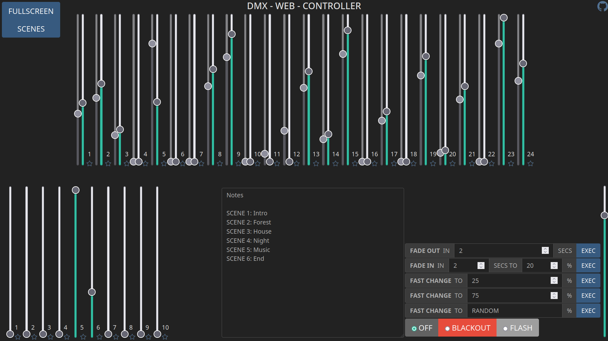

# DMXwebController
<b>STILL IN DEVELOPMENT</b>

A simple web environment to simulate a lighting console and connect it to a Thinkerforge DMX Bricklet interface. Suitable for low end use. (theaters without special effects, speakers, ...) It is mainly desinged for my school lightning system, which does not has some fancy RGB-lights etc. Therefore this system only supports 24 channels. <i>(future project: make it scalable to use all 512 Channels)</i>

## libs / frameworks
- nodejs
- express
- socketio
- thinkerforge JS API
- bootstrap
- bootstrap-dark-5
- bootstrap-icons
- jquery

## UI screenshots

