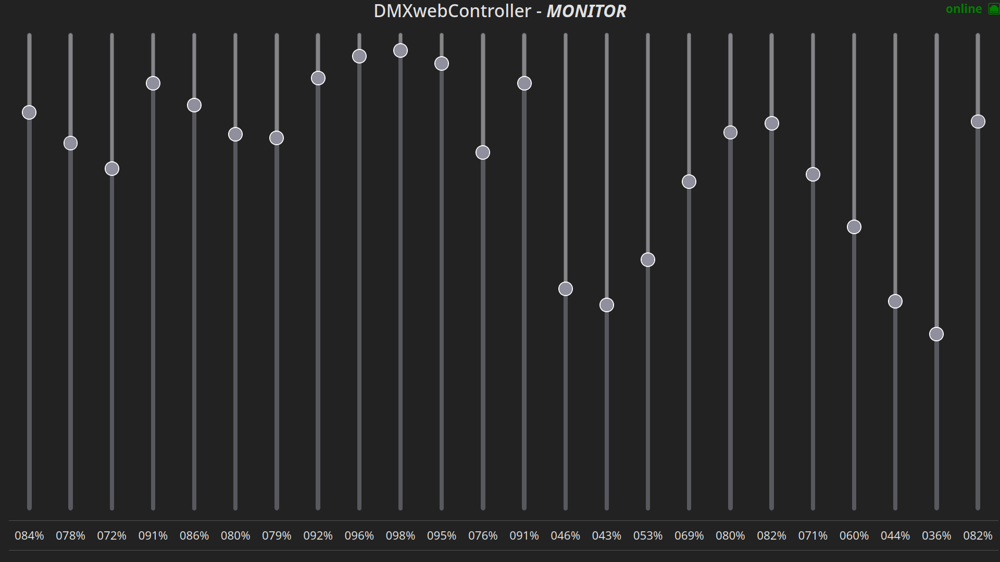

# DMXwebController
<b>STABLE NOW 🥳🥳🥳</b>

A simple web environment to simulate a lighting console and connect it to a Thinkerforge DMX Bricklet interface. Suitable for low end use. (theaters without special effects, speakers, ...) The software is mainly desinged for my school lightning system, which does not offer some fancy RGB-lights etc. Therefore this system only supports 24 channels. The goal is to create a easy to understand UI for non teckies. <i>(future project: make it scalable to use all 512 Channels)</i> 
## features

- scenes
- blackout/flash
- fast change menue
- instant output feedback
- notes
- multi client handling
- http basic auth
- export / import of settings files
- seperate monitor view

## planed UI interfaces

- [x] easy24
  - [x] different scenes
  - [x] auto fading/cross fading
  - [x] scene export/import
  - [ ] random scene generator
  - [ ] copy scenes
- [x] easy256
- [ ] easy512
- [x] mobile
- [ ] scriptUI
  - A script based client for effect automation and easy procedure/effect programming <i>(currently working on)</i>
- [ ] complex
- [ ] rgb
- [ ] modular

- [x] monitor disply (24)

## libs / frameworks
- <a href="https://github.com/nodejs/node">nodejs</a>
- <a href="https://github.com/expressjs/express">express</a>
- <a href="https://github.com/socketio/socket.io">socketio</a>
- <a href="https://github.com/Tinkerforge/generators/tree/master">thinkerforge JS API</a>
- <a href="https://github.com/twbs/bootstrap">bootstrap</a>
- <a href="https://github.com/vinorodrigues/bootstrap-dark-5">bootstrap-dark-5</a>
- <a href="https://github.com/twbs/icons">bootstrap-icons</a>
- <a href="https://github.com/Script47/bs5-utils">Bs5Utils</a>
- <a href="https://github.com/jquery/jquery">jquery</a>

## UI screenshots

